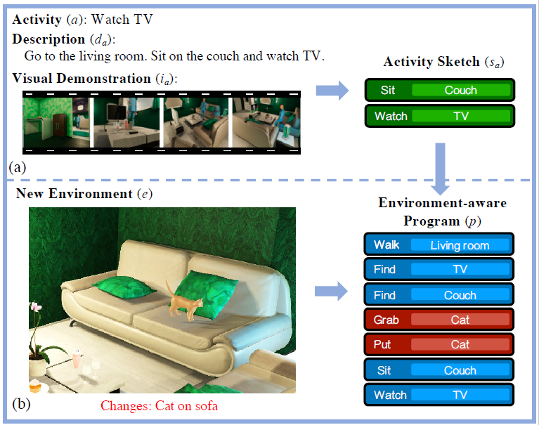
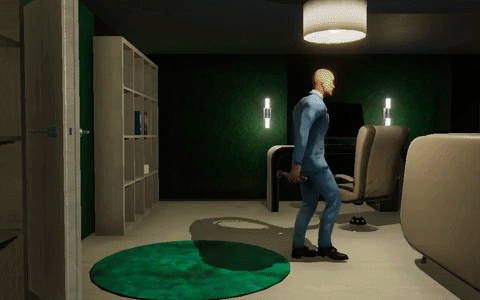

# Synthesizing Environment-Aware Activities via Activity Sketches

This is the official implementation of ResActGraph (CVPR2019). For technical details, please refer to [here](ARXIV_LINK)

**Synthesizing Environment-Aware Activities via Activity Sketches**

*[Yuan-Hong Liao](https://andrewliao11.github.io)∗, [Xavier Puig](https://people.csail.mit.edu/xavierpuig/)∗, Marko Boben, [Antonio Torralba](http://web.mit.edu/torralba/www/), [Sanja Fidler](http://www.cs.utoronto.ca/~fidler/)*

If you find the code useful in your research, please consider citing:

```
ARXIV_INFO
```

## Contents 
- Introduction
- Environment Setup
- Training


## Introduction



In order to perform activities from demonstrations or descriptions,
agents need to distill what the essense of the given activity is. 
In this work, we address the problem of *environment-aware program generation*.
Given a visual demonstration or a description of an activity, 
we generate program sketches representing the essential instructions
and propose a model, **ResActGraph**, to transform these into full programs
representing the actions needed to perform the activity under the presented environmental constraints.

Here is one short clip where the agent is chilling out in his living room.

<p align="center">


## Environment Setup

### Create a virtual environment (Optional)

```bash
$ virtualenv -p python3 virtualhome
$ source virtualhome/bin/activate
(virtualhome) $ git clone https://github.com/andrewliao11/env-aware-program-gen.git
(virtualhome) $ cd env-aware-program-gen
(virtualhome) $ pip3 install -r requirements.txt
```

### Install VirtualHome
To execute or evalutate the sampled programs, VirtualHome need to be installed.
Please see [here](VH_LINK) for the installation.


### Data

Download the program dataset [here](DATASET_LINK) and the augmented program dataset [here](DATASET_LINK)

Here is how the dataset structure should look like:

```
dataset
└── VirtualHome-Env
    ├── augment_programs
    │   ├── augment_exception
    │   └── augment_location
    ├── demonstration
    │   ├── images
    │   └── images_augment
    ├── original_programs
    ├── resources
    │   ├── class_name_equivalence.json
    │   ├── knowledge_base.npz
    │   ├── object_merged.json
    │   ├── object_prefabs.json
    │   └── object_script_placing.json
    ├── sketch_annotation.json
    └── split
        ├── test_progs_paths.txt
        └── train_progs_paths.txt
```

## Training

The training of the program/sketch generation model is documneted [here](/src/README.md)
